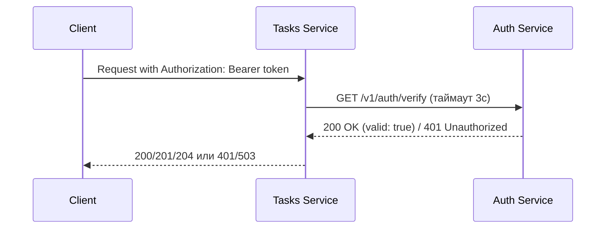

# Практика 1

## Выполнил: Студент ЭФМО-02-25 Выборнов Олег Андреевич

---

## Структура проекта

```
tech-ip-sem2/
├── services/
│   ├── auth/
│   │   ├── cmd/auth/
│   │   │   └── main.go
│   │   └── internal/
│   │       ├── http/
│   │       │   └── handler.go
│   │       └── service/
│   │           └── auth.go
│   └── tasks/
│       ├── cmd/tasks/
│       │   └── main.go
│       └── internal/
│           ├── http/
│           │   └── handler.go
│           ├── service/
│           │   └── task.go
│           └── client/authclient/
│               └── http.go
├── shared/
│   ├── middleware/
│   │   ├── requestid.go
│   │   └── logging.go
│   └── httpx/
│       └── client.go
├── docs/
│   └── api.md
├── go.mod
└── README.md
```

---

## 1. Описание границ сервисов

**Auth Service** — отвечает за аутентификацию и выдачу токенов. В учебной реализации хранит фиксированную пару логин/пароль (`student`/`student`) и возвращает предопределённый токен `demo-token`. Предоставляет эндпоинт для проверки токена, который возвращает статус валидности и имя субъекта. Не знает ничего о задачах и бизнес-логике Tasks.

**Tasks Service** — управляет задачами (CRUD) в оперативной памяти. Не хранит информацию о пользователях. Перед выполнением каждой операции обращается к Auth Service для проверки токена с таймаутом 3 секунды. Полностью делегирует авторизацию внешнему сервису.

Границы чётко разделены: Auth занимается только вопросами безопасности, Tasks — только бизнес-логикой работы с задачами.

---

## 2. Схема взаимодействия


```
Client ──POST /v1/tasks──► Tasks Service ──GET /v1/auth/verify──► Auth Service
                                        ◄── 200 OK / 401 ─────────────────────
       ◄── 201 Created / 401 ──────────
```

---

## 3. Список эндпоинтов

### Auth Service (порт 8081)

| Метод | Путь | Описание | Коды ответов |
|-------|------|----------|--------------|
| POST | `/v1/auth/login` | Получение токена | 200, 400, 401 |
| GET | `/v1/auth/verify` | Проверка валидности токена | 200, 401 |

**POST /v1/auth/login** — запрос:
```json
{
  "username": "student",
  "password": "student"
}
```
Ответ 200:
```json
{
  "access_token": "demo-token",
  "token_type": "Bearer"
}
```

**GET /v1/auth/verify** — заголовки: `Authorization: Bearer demo-token`

Ответ 200:
```json
{
  "valid": true,
  "subject": "student"
}
```

---

### Tasks Service (порт 8082)

Все запросы требуют заголовок `Authorization: Bearer <token>`

| Метод | Путь | Описание | Коды ответов |
|-------|------|----------|--------------|
| POST | `/v1/tasks` | Создание задачи | 201, 400, 401 |
| GET | `/v1/tasks` | Список всех задач | 200, 401 |
| GET | `/v1/tasks/{id}` | Получение задачи по ID | 200, 401, 404 |
| PATCH | `/v1/tasks/{id}` | Обновление задачи | 200, 400, 401, 404 |
| DELETE | `/v1/tasks/{id}` | Удаление задачи | 204, 401, 404 |

---

## 4. Скриншоты Postman с подтверждением работы

### 4.1 POST /v1/auth/login — получение токена (200 OK)


### 4.2 GET /v1/auth/verify — проверка токена (200 OK)


### 4.3 POST /v1/tasks — создание задачи (201 Created)


### 4.4 GET /v1/tasks — список задач (200 OK)


### 4.5 GET /v1/tasks без токена — отказ в доступе (401 Unauthorized)


---

## 5. Логи с подтверждением прокидывания X-Request-ID

### Логи Auth Service


### Логи Tasks Service


---

## 6. Инструкция запуска

### Требования
- Go 1.22+
- Git

### Установка
```bash
git clone https://github.com/omnikk/pz2.1.git
cd pz2.1
go mod download
```

### Запуск Auth Service (Терминал 1)
```powershell
$env:AUTH_PORT="8081"
go run ./services/auth/cmd/auth
```

### Запуск Tasks Service (Терминал 2)
```powershell
$env:TASKS_PORT="8082"
$env:AUTH_BASE_URL="http://localhost:8081"
go run ./services/tasks/cmd/tasks
```

### Переменные окружения

| Переменная | Сервис | По умолчанию |
|------------|--------|--------------|
| AUTH_PORT | Auth | 8081 |
| TASKS_PORT | Tasks | 8082 |
| AUTH_BASE_URL | Tasks | http://localhost:8081 |

---

## 7. Тестирование через curl

```powershell
# Получить токен
Set-Content -Path body.json -Value '{"username":"student","password":"student"}'
curl.exe -s -X POST http://localhost:8081/v1/auth/login -H "Content-Type: application/json" -H "X-Request-ID: req-001" -d "@body.json"

# Проверить токен напрямую
curl.exe -i http://localhost:8081/v1/auth/verify -H "Authorization: Bearer demo-token" -H "X-Request-ID: req-002"

# Создать задачу
Set-Content -Path task.json -Value '{"title":"Do PZ1","description":"split services","due_date":"2026-01-10"}'
curl.exe -i -X POST http://localhost:8082/v1/tasks -H "Content-Type: application/json" -H "Authorization: Bearer demo-token" -H "X-Request-ID: req-003" -d "@task.json"

# Список задач
curl.exe -i http://localhost:8082/v1/tasks -H "Authorization: Bearer demo-token" -H "X-Request-ID: req-004"

# Без токена — должен вернуть 401
curl.exe -i http://localhost:8082/v1/tasks -H "X-Request-ID: req-005"
```

---

## 8. Ответы на контрольные вопросы

**1. Почему межсервисный вызов должен иметь таймаут?**

Таймаут предотвращает каскадные отказы: если Auth Service зависнет, Tasks не будет бесконечно ждать ответа, а вернёт клиенту ошибку через 3 секунды. Без таймаута накапливаются заблокированные горутины, что приводит к исчерпанию ресурсов и отказу всего сервиса.

**2. Чем request-id помогает при диагностике ошибок?**

`X-Request-ID` — уникальный идентификатор, который прокидывается через все сервисы в цепочке вызовов. Позволяет связать логи Auth и Tasks для одного пользовательского запроса и быстро найти, на каком этапе произошла ошибка.

**3. Какие статусы нужно вернуть клиенту при невалидном токене?**

`401 Unauthorized` — стандартный HTTP-статус, означающий что клиент не прошёл аутентификацию.

**4. Чем опасно "делить одну БД" между сервисами?**

Общая БД создаёт жёсткую связность между сервисами: изменение схемы в одном сервисе ломает другой. Это противоречит принципу независимости микросервисов, усложняет масштабирование и делает невозможным независимый деплой.
